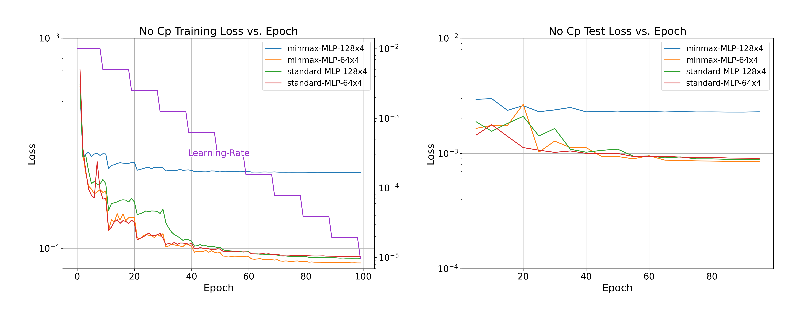
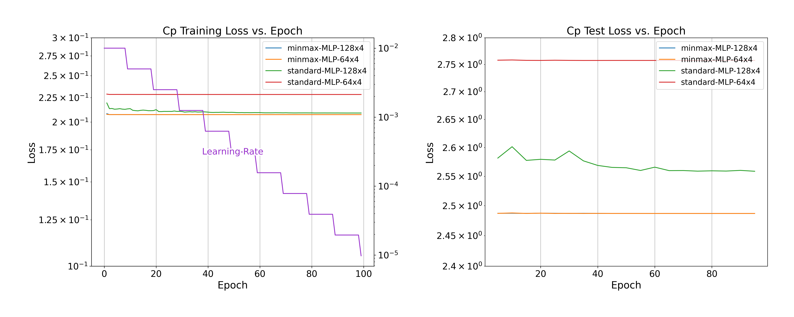
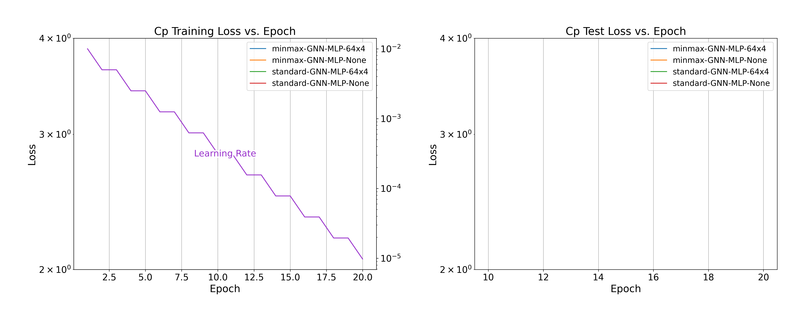

# Training using Pytorch
Below are the steps you should take in order to go from the dataset created in `../generate_xfoil` to training and visualizing the results.

1. `python setup_dataset.py`: This file sets up the local dataset by dividing the full normalized dataset generated by `../generate_xfoil/Step4_CreateDataset.py` into portions used for training and testing. The main dataset is very large and not all the data is needed to train the machine learning model so a random sample of that dataset is taken and divided into test and train. 


The reason why a portion is used is due to training speed. You can control how much of the total dataset is used by editing the settings.json and look for `percent_dataset`. If the `percent_dataset` is the same for all the keys in `data` then exact same data is the test and train dataset found in the folders `minmax` and `standard`. Having the data for both normalization methods makes it posible to compare and contrast.

2. `python train_gnn.py`: Run this command to train a graph neural network to predict Cl,Cd,Cdp, and Cm. This file will create 2 folders `./checkpoints/minmax` and `./checkpoints/minmax` and save different neural network configurations inside. 

Example of a configuration from `settings.json`
```json
 "networks":[
            {
                "type":"gnn",
                "scaler_type":"minmax",
                "train":{
                    "GnnLayers": [3,16,32,64],
                    "hiddenLayers": null,
                    "learning_rate": 1E-2,
                    "weighted_decay":1e-1,
                    "epochs": 20,
                    "batch_size":64,
                    "num_workers":0,
                    "validation_epoch":10,
                    "output_dir":"checkpoints/minmax"
                }
            }
        ]
```


3. `python train_gnn_cp.py` Train a graph neural network to predict Cl,Cd,Cdp,Cm, and Cp. Similar to the above. It reads from the same settings files. 
4. `python train_dnn.py` Trains a deep neural network to predict and plot the results of the training

To modify any of the parameters, edit `settings.json`. All training code runs on the exact same data. The data is formatted differently for Graph Neural Networks compared to Deep Neural Networks. 

---
Note: 
PyTorch Geometric sometimes does not work on linux machines. Training was done using windows. Do not use Mac for graph neural network training - train times can more than 90x slower. This is as of 1/13/2022. Things can change in the future.
---

# Plotting Training Results

## Training Loss History 
Both Deep Neural Networks and Graph Neural network training was done using 20% of the available dataset and of that 20%, 80% was used for training while 20% was used for test. You can configure this by changing the `percent_train` parameter in `settings.json`. Graph network training took a total of 10 hours due to the structure of the dataset being in object form. Deep Neural network on the otherhand took about 1 hour to train. 

To generate plots of loss, run `python plot_train_history.py` only after you have already trained the models. You may need to edit this file so that it reads the correct checkpoint folders. 

### Deep Neural Network 
Below is an example of the training loss vs time for a deep neural network. Two networks were trained. One network had a hidden layer size of [64,64,64,64] and the other was [128,128,128,128]. Additionaly, two types of scalers used for normalization were compared. [standard scaler](https://scikit-learn.org/stable/modules/generated/sklearn.preprocessing.StandardScaler.html) and [minmax scaler](https://scikit-learn.org/stable/modules/generated/sklearn.preprocessing.MinMaxScaler.html). Training loss was lowest for the standard scaler. 




When using Deep Neural networks to predict the Cp, none of the models were able to accurately predict this. This could be because of the size of the output layer (202) is more than the input layer (201). In addition to the Cp which is a vector, the Cl, Cd, Cdp, and Cm were also predicted.



### Graph Neural Network 
Graph Nerual networks training without predicting Cp had a higher loss than Deep Neural networks, however the network was more suited to for the minmax normalization than standard normalization used for deep neural networks. The plot shows a step decay in learning rate. This step was needed to reduce the averaged training error.


Graph Neural Networks was not able to predict the Cl, Cd, Cdp, and Cm as well as the Cp at each point. Reducing the number of output parameters may help with predicting the Cp. 


## Examples
1. Code to download preprocessed airfoil dataset 


Another design


